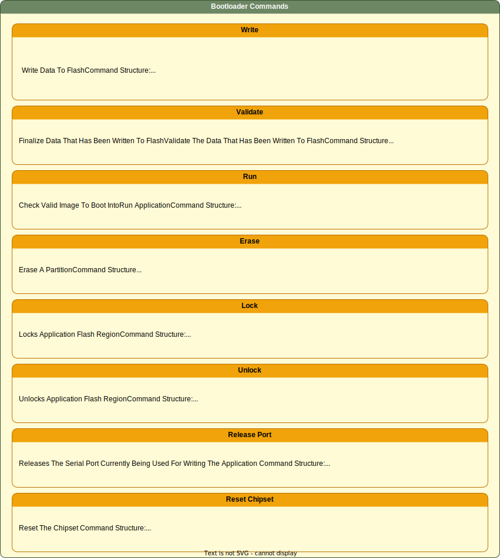
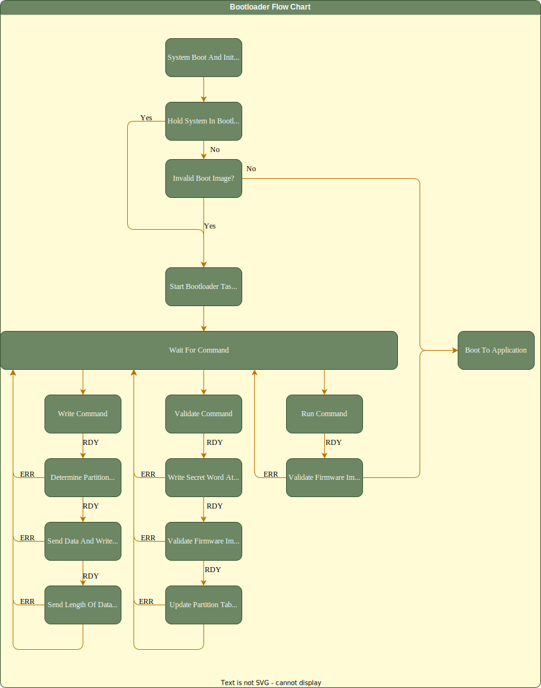

# polyglot
Open Source Embedded Bootloader Framework

`polyglot` offers a scalable,
secure way to load applications to embedded devices.
It uses an abstract "serial" layer
that allows for any type of serial connection to be used as a way to load firmware.
For example,
this serial line may be USB,
Bluetooth Connection,
TCP Socket, etc.
as long as it follows the requirements of the callback functions laid out in the bootloader's configuration.

`polyglot` utilzies AES-CBC encryption/decryption and SHA256 for signing firmware images.
These functionalities are all configurable in firmware through the the bootloader's configuration.

Below describes the list of commands available to send to the device.

The following describes the bootloader's flow when loading an application:

